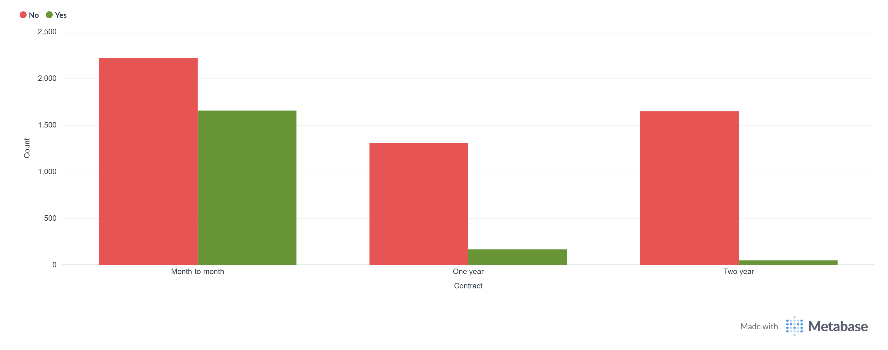
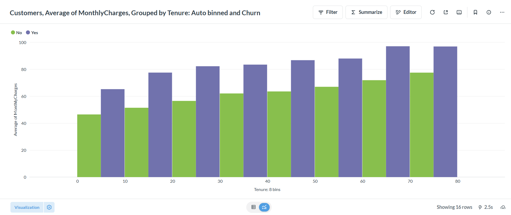
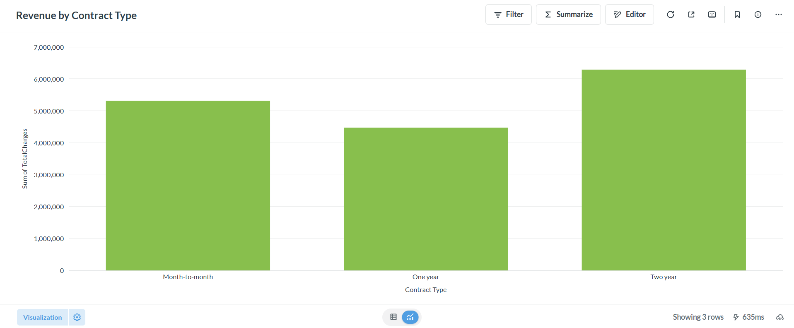

# Dashboard Documentation

## Overview

The dashboard provides business-focused analytics for the Customer Churn
Prediction & Lifetime Value (LTV) Engine.

It combines customer-level churn information, customer charges, contract
details, tenure, and model predictions to help identify churn patterns and
prioritize retention opportunities.

## Dashboard Visualizations

### 1. Churn by Contract Type

This visualization compares customer churn across different contract types.

It helps identify contract segments with higher churn rates and supports
retention strategies focused on customers with shorter-term contracts.

### 2. Charges by Tenure and Churn

This visualization examines the relationship between customer tenure,
monthly charges, and churn status.

It helps identify customer groups where spending and tenure may be associated
with different churn patterns.

### 3. Revenue by Contract Type

This visualization compares revenue contribution across contract types.

It provides a business view of how different contract segments contribute
to customer revenue.

## Prediction Analytics

The SQL dashboard queries also use the `customer_predictions` table
generated by the prediction pipeline.

The prediction analytics include:

- Overall predicted churn probability
- Average and total predicted LTV
- Predicted LTV by actual churn status
- High-risk customers
- High-risk and high-value customers
- Prediction performance by actual churn status
- Customer risk/value segmentation

The risk/value analysis divides customers into four segments:

| Segment | Description |
|---|---|
| High Risk / High Value | Customers with high churn probability and above-average predicted LTV |
| High Risk / Low Value | Customers with high churn probability and below-average predicted LTV |
| Low Risk / High Value | Customers with lower churn probability and above-average predicted LTV |
| Low Risk / Low Value | Customers with lower churn probability and below-average predicted LTV |

The **High Risk / High Value** segment can be used as a priority group for
retention analysis because these customers combine elevated churn risk with
higher predicted customer value.

## Business Use

The dashboard can help marketing and retention teams:

- Identify high-churn customer segments
- Compare churn across contract types
- Understand the relationship between tenure and customer charges
- Analyze revenue contribution by contract type
- Identify high-risk customers
- Prioritize high-risk, high-value customers for retention analysis
- Compare predicted LTV across customer segments

## Dashboard Data

The visualizations are based on the Telco Customer Churn dataset containing
7,043 customer records.

Prediction-based analytics use the `customer_predictions` table, which
contains:

- `customerID`
- `churn_probability`
- `predicted_ltv`
- `actual_churn`

The analytical SQL queries used to support these dashboard metrics are
available in:

`../sql/dashboard_queries.sql`